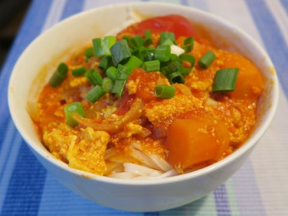

```{r setup, include=FALSE}
# Load the function from the helpers.R script
source("scripts/helper.R")
```

# Ham Dan 咸蛋 (Zutatenmenge nicht getestet)

Das Gericht kommt aus Vietnam und wurde vor allem von armen Personen gekocht, die sich kaum etwas leisten konnten. Daher wird das salzige Gericht ursprünglich nur mit Reis gemischt und gegessen.

## TO-DO Liste

-   Bild von Gericht einfügen

## Zutaten

```{r echo=FALSE, results='asis'}
ingredients <- read_excel("tbl/ham-dan.xlsx")
ingredients[is.na(ingredients)] <- ""
generate_ingredient_table(ingredients)
```

## Zubereitung

1.  Die Eier hart kochen und die Schale entfernen.
2.  Die geschälten Eier in einer Schüssel fein hacken.
3.  Die gehackten Eier gründlich mixen, bis eine gleichmäßige Masse entsteht.
4.  Fischsoße und Sojasoße zum Abschmecken hinzufügen.
5.  Das fertige Gericht in der Regel mit weißem Reis servieren.

# Bun Rieu ohne Krabben (Zutatenmenge nicht getestet)

```{r echo=FALSE, out.width='100%'}

```

Vietnamnesische Reisnudelsuppe mit Schweinsknochen

## Zutaten

```{r echo=FALSE, results='asis'}
ingredients <- read_excel("tbl/bun-rieu.xlsx", na = c("", "NA"))
ingredients[is.na(ingredients)] <- ""
generate_ingredient_table(ingredients)
```

## Zubereitung

**Zubereitung für die vietnamesische Nudelsuppe Bun Rieu:**

1.  **Vorbereitung der Basis:**
  - Zwiebeln fein hacken und Karotten in etwa 1 cm große Stücke schneiden.
  - Zwiebeln in einem großen Topf mit etwas Öl anschwitzen, bis sie glasig sind.
  - Tomatenmark und die Karotten hinzufügen, kurz anbraten, bis alles leicht aromatisch ist.

2.  **Zubereitung der Brühe:**
  - Wasser in den Topf gießen.
  - Schweineknochen und geviertelte Tomaten hinzufügen.
  - Die Suppe auf mittlerer Hitze etwa 1 Stunde köcheln lassen, damit die Aromen sich entfalten können.

3.  **Vorbereitung der Beilagen:**
  -   Limetten achteln.
  -   Sojasprossen gründlich waschen.
  -   Frühlingszwiebeln fein hacken.
  -   Eisbergsalat in etwa 10 cm lange Streifen schneiden.
  -   Optional: Thai-Basilikumblätter von den Stängeln zupfen.

4.  **Zubereitung der Reisnudeln:**
  -   Die Reisnudeln in einem separaten Topf gemäß Packungsanleitung gar kochen.

5.  **Finalisieren der Suppe:**
  -   Kurz vor dem Anrichten die verquirlten Eier langsam in die köchelnde Suppe einrühren, sodass feine Fäden entstehen.
  -   Mit Fischsoße abschmecken, um der Suppe ihre charakteristische Würze zu verleihen.

6.  **Servieren:**
  -   Die Reisnudeln in Schalen anrichten, die heiße Suppe darübergeben und mit den vorbereiteten Beilagen nach Belieben garnieren.

# Chicken madras (Zutatenmenge testen)

Indisches Hähnchen-Curry von bbcgoodfood.com (Elena Silcock)

## TO-DO Liste

-   Bild von Gericht einfügen

## Zutaten

```{r echo=FALSE, results='asis'}
ingredients <- read_excel("tbl/chicken-madras.xlsx")
ingredients[is.na(ingredients)] <- ""
generate_ingredient_table(ingredients)
```

## Zubereitung

1.  **Paste zubereiten:**
  - Die geviertelten Zwiebeln, die Knoblauchzehen, den Ingwer und die halbe Chili in einen Mixer geben und zu einer glatten Paste verarbeiten.

2.  **Paste anbraten:**
  -   Öl in einer großen Pfanne oder einem Topf erhitzen.
  -   Die vorbereitete Paste darin bei mittlerer Hitze etwa 5 Minuten anbraten, bis sie weich ist und ein aromatischer Duft entsteht.
  -   Sollte die Paste an der Pfanne kleben, etwas Wasser hinzufügen und weiter rühren.

3.  **Gewürze hinzufügen:**
  -   Kurkuma, Kreuzkümmel, Koriander und Chilipulver in die Pfanne geben.
  -   Die Mischung gut umrühren und für 1--2 Minuten rösten, damit die Gewürze ihr Aroma entfalten.

4.  **Hähnchen anbraten:**
  -   Die in Stücke geschnittene Hähnchenbrust hinzufügen und gut mit der Gewürzpaste vermengen, sodass alle Stücke gleichmäßig bedeckt sind.
  -   Die Hähnchenstücke anbraten, bis sie von allen Seiten weiß werden. Falls nötig, etwas Wasser hinzufügen, um ein Ankleben zu verhindern.

5.  **Tomaten und Köcheln:**
  -   Die gehackten Tomaten und eine Prise Salz in die Pfanne geben.
  -   Alles gut umrühren, die Pfanne mit einem Deckel abdecken und das Gericht bei niedriger Hitze 25--30 Minuten köcheln lassen, bis das Hähnchen zart ist und die Soße leicht eingedickt ist.

# Chinesische Kartoffelsuppe (Zutatenmenge testen)

## TO-DO Liste

-   Bild von Gericht einfügen

## Zutaten

```{r echo=FALSE, results='asis'}
ingredients <- read_excel("tbl/chinesische-kartoffelsuppe.xlsx")
ingredients[is.na(ingredients)] <- ""
generate_ingredient_table(ingredients)
```

## Zubereitung

1.  **Vorbereitung:**
  -   Kartoffeln schälen und in feine Streifen schneiden.
  -   Frühlingszwiebeln waschen und in kleine Ringe hacken.

2.  **Kartoffeln vorkochen:**
  -   Einen Topf mit Wasser zum Kochen bringen und die Kartoffelstreifen hineingeben.
  -   Die Kartoffeln etwa 3--5 Minuten vorkochen, bis sie leicht weich werden.

3.  **Grundlage würzen:**
  -   Salz und Brühe (z. B. Hühner- oder Gemüsebrühe) in den Topf geben und gut umrühren.
  -   Die Hitze reduzieren und die Suppe leicht köcheln lassen.

4.  **Eier und Frühlingszwiebeln hinzufügen:**
  -   Die Eier in einer separaten Schüssel verquirlen.
  -   Die verquirlten Eier langsam in die köchelnde Suppe gießen, dabei ständig rühren, um feine Eifäden zu erzeugen.
  -   Die gehackten Frühlingszwiebeln hinzufügen und kurz mitkochen.

5.  **Konsistenz anpassen:**
  -   Kartoffelmehl in einer kleinen Schüssel mit etwas kaltem Wasser anrühren, bis keine Klümpchen mehr vorhanden sind.
  -   Die Mischung langsam in die Suppe geben, dabei ständig rühren, bis die gewünschte Konsistenz erreicht ist.

6.  **Abschmecken:**
  -   Die Suppe mit ein paar Tropfen Sesamöl verfeinern.
  -   Nach Geschmack zusätzlich mit Pfeffer würzen.
