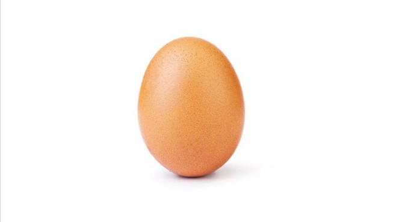

# Backrezepte

Cross-references make it easier for your readers to find and link to elements in your book.

## Beispiel Rezept 咸蛋

### TO-DO Liste

- Bild von Gericht einfügen
-  ~~Zutaten bestimmen~~
- Zutatenmenge für 4 Portionen bestimmen
- Zubereitungstext ausformulieren 

### Beschreibung {-}

Das Gericht kommt aus Vietnam und wurde vor allem von armen Personen gekocht, die sich kaum etwas leisten konnten. Daher wird das salzige Gericht ursprünglich nur mit Reis gemischt und gegessen.

### Zutatenliste {-}

Zutat | Menge 
---|---:
Eier | beliebig
Fischsoße | ?
Helle Sojasoße 生油 oder Maggi Gewürz | ?

### Zubereitung {-}

Eier werden fesgekocht. Die festgekochten Eier werden klein zerhackt und durchgemixt. Zum Abschmecken werden zuerst Fischsoße und Sojasoße dazugegeben. Zuletzt wird nach etwas mit Salz abgeschmeckt. Wenig Salz wird gebraucht, da Fisch- und Sojasoße sehr salzig sind. 
