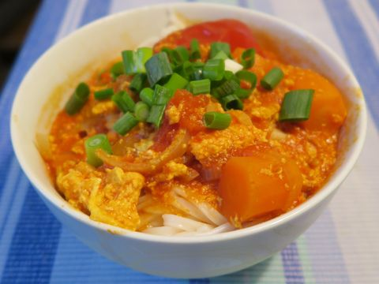

# Kochrezepte

## Ham Dan 咸蛋

### TO-DO Liste

- Bild von Gericht einfügen
-  ~~Zutaten bestimmen~~
- Zutatenmenge für 4 Portionen bestimmen
- Zubereitungstext ausformulieren 

#### Beschreibung {-}

Das Gericht kommt aus Vietnam und wurde vor allem von armen Personen gekocht, die sich kaum etwas leisten konnten. Daher wird das salzige Gericht ursprünglich nur mit Reis gemischt und gegessen.

#### Zutatenliste {-}

Zutat | Menge 
---|---:
Eier | beliebig
Fischsoße | ?
Helle Sojasoße 生油 oder Maggi Gewürz | ?

#### Zubereitung {-}

Die Eier werden fesgekocht. Die festgekochten Eier werden klein gehackt und durchgemixt. Zum Abschmecken werden zuerst Fischsoße und Sojasoße dazugegeben. Zuletzt wird noch etwas mit Salz abgeschmeckt. Wenig Salz wird gebraucht, da Fisch- und Sojasoße sehr salzig sind. 

## Bung Niu

### TO-DO Liste

- Bild von Gericht einfügen
-  ~~Zutaten bestimmen~~
- Zutatenmenge für 4 Portionen bestimmen
- Zubereitungstext formulieren 

#### Beschreibung {-}

Reisnudelsuppe mit Schweinsknochen

#### Zutatenliste {-}

##### Suppe {-}
Zutat | Menge 
---|---:
Schweinsknochen | 
Tomatenmark (3-fach konzentriert) | 0,5 Tube (100 g)
Frische Tomaten | ca. 650 g
Fischsoße | 
Zwiebeln | 2 große (ca. 150 g pro Stück)
Eier | 4 M Eier
Wasser | 1,5 l
Sonnenblumenöl | 

##### Beilagen {-}

Zutat | Menge 
---|---:
Reisnudeln | 400 g  
Eisbergsalat |
Sojasprossen |
Frühlingszwiebeln |
Zitrone oder Limette | 

#### Zubereitung {-}

## Chicken madras

von bbcgoodfood.com (Elena Silcock)

### TO-DO Liste

- Bild von Gericht einfügen
-  ~~Zutaten bestimmen~~
- Zutatenmenge für 4 Portionen bestimmen
- Zubereitungstext formulieren 

#### Beschreibung {-}
Indisches Hähnchen-Curry

#### Zutatenliste {-}

Zutat | Menge 
---|---:
Zwiebel | 1 (geviertelt)
Knoblauch | 2 Zehen
Ingwer | 1 (daumengroß, geschält)
Chili (rot) | 1/2
Öl (vegetarisch) | 1 Teelöffel
Kurkuma | 1/2 Teelöffel
Kreuzkümmel gemahlen | 1 Teelöffel
Koriander gemahlen | 1 Teelöffel
Chilipulver | 1-2 Teelöffel
Hähnchenbrust | 4 gestückelt
Tomaten gehackt | 400 g
Salz | Prise
Reis gekocht |

#### Zubereitung {-}

1. Mit einem Mixer die geviertelten Zwiebeln, die zwei Knoblauchzehen, den Ingwer und die halbe Chili zu einer Paste zerkleinern.
2. Öl in Pfanne erhitzen und dann die Paste für 5 Minuten anbraten bis sie weich wird. Wenn sie an der Pfanne klebt, etwas Wasser hinzufügen.
3. Füge Kurkuma, Kreuzkümmel, Koriander und Chilipulver hinzu, rühre gut um und koche alles für ein paar Minuten, um die Paste etwas zu "toasten". Füge danach die Hähnchenbrust (Stücke) hinzu und mische diese mit der Paste, so dass die Stücke alle mit der Gewürzmischung überdeckt sind.
4. Koche die Hähnchenbrust bis sie weiß wird. Evtl. etwas Wasser hinzufügen.
5. Gieße die gehackten Tomaten mit ein wenig gestreutem Salz in die Pfanne, decke dann die Pfanne mit einem Deckel ab und koche das Gericht bei kleiner Hitze für 30 Minuten bis die Hähnchenbrust zart ist. 

## Banh Cuon

### TO-DO Liste

- Bild von Gericht einfügen
-  ~~Zutaten bestimmen~~

Beilagen müssen noch erweitert werden. Chinesische Namen müssen noch eingefügt werden. Und die Beilagen zum Essen müssen nochmals nachgefragt werden. Formulierung der Zubereitung (Füllung) ist noch zu vage.

#### Beschreibung {-}

...

#### Zutatenliste {-}

##### Teig {-}

Zutat | Menge 
---|---:
Tapiokastärke 木薯粉 | 200 g
Reismehl 米粉 (white rice flour blau) | 200 g
Weizenstärke, -mehl (wheat starch rot) | 2 Esslöffel
Maisstärke | 2 Esslöffel
Wasser (lauwarm) | 1 l
Salz | 1 Teelöffel

##### Füllung {-}
Zutat | Menge 
---|---:
Schweinenacken oder Hackfleisch | ?? 300 g
Zwiebeln | ??
Morcheln | ??
Maggi, Soja |
Salz | ?
Zucker | ?
Pfeffer | ?
Sesamöl | ?
Austernsoße | ?

##### Beilagen {-}
Zutat | Menge 
---|---:
Fischsoßenessig | ?
Eingelegte Essigkarotten | ?
Vietnamnesischer Wurst Za | ?
frische Thai-Basilikum
Koriander 芫荽 | ? 
Pfefferminzblätter | ?
Gurke (Streifen) | ?
Eisbergsalat | ?
Sojasprossen | ?

#### Zubereitung {-}

##### Teig {-}

Alle Mehlarten in einem großen Schüssel vermischen. 1 l Wasser wird unter stetigen Rühren des Teigs langsam in die Schüssel dazugegeben. Der Teig wird sehr zäh und ist so gewollt. Der Teig muss nun solange gerührt bis viele Blasen entstehen. Nun wird 2 Suppenlöffel Öl in die Schüssel gekippt und danach kommt das restliche 1 l Wasser in die Schüssel. Der Teig müsste jetzt relativ flüssig sein. Nun kommt die gute beschichtete Bratpfanne zum Einsatz. Diese wird ohne Öl (auf mittlere Hitze???) erhitzt.

Die Pfanne wird nun mit einer Kelle flüssigen Teigwasser aufgefüllt und sofort muss die Pfanne abgedeckt werden. Der Teig wird dabei nur kurz angebraten. Der fertig gebratener Teig wird auf die mit vorher eingeölte Theke geschmissen. Nun
wird die etwas Füllung auf den Teig gelegt und der Teig wird zusammengerollt und nun ist ein Ban Guen fertig. Diese Prozedur wird solange wiederholt, bis entweder die Füllung oder der Teig ausgegangen ist.

ALTER TEXT

Mehlsorten mixen und langsam Wasser hinzufügen, bis sich Blasen bilden. Abgedeckt 1 bis 2 h ziehen lassen.
Bei heißer beschichteter, gute nicht klebende Pfanne (ohne Öl) wird der flüssiger Teig reingegossen und abgedeckt. Nach kurzer Zeit wird der fertige Teig auf ein geöltes Teller geschmissen. Danach wird der Teig mit Füllung (gehackt, gemischt) eingerollt. 

##### Füllung {-}
Zwiebeln, Knoblauch, Morcheln und den Schweinenacken werden in einem Mixer zerhackt. Nun wird der zerhackte Schweinenacken mit Öl trocken gebraten. Danach werden Zwiebeln und Knoblauch hinzugefügt und mitbraten bis es duftet. Als letztes werden die Morcheln dazugegeben und mitgebraten. Als nächstes wird die Füllung mit Salz (wenig), Pfeffer, Zucker, Sojasoße, Sesamöl und Austernsoße abgeschmeckt. Wenn die Füllung fast fertig gebraten ist, wird Kartoffelmehl ohne Wasser hinzugegeben. Die Füllung soll nun leicht klebrig sein. Als letztes wird ein wenig Geschmacksverstärker für die Füllung verwendet.

## Pho Bo

### TO-DO Liste

- Bild von Gericht einfügen
-  ~~Zutaten bestimmen~~
- Zutatenmenge für 4 Portionen bestimmen
- Zubereitungstext formulieren 

#### Beschreibung {-}

Vietnamnesische Rindernudelsuppe. 

##### Vegetarische Variante {-}

Die vegetarische Variante basiert auf einer Gemüsebrühe ohne Rinderknochen, Rinderfilet,  Fischsoße, Hoisin-Soße. Statt Fischsoße kann auch Sojasoße verwendet werden. Das Vorkochen der Rinderbrühe entfällt dann in der Zubereitung

#### Zutatenliste {-}

##### Rinderbrühe {-}
Zutat | Menge 
---|---:
Rinderknochen mit Fleisch | 2,5 kg
Rettich | 2 Stück
Zwiebel | 2 Stück
Zimtstange | 1/2
Sternanis | 60 g
Nelken | 2 
Pfefferkörner | -
Ingwer | 1 Knolle
Salz | ?
Zucker | ?
Fischsoße | ?

##### Einlage {-}
Zutat | Menge 
---|---:
Rinderfilet | 250 g
Reisnudeln (flach 3 mm) | 700 g

##### Einlage {-}
Zutat | Menge 
---|---:
Koriander | ?
Sojasprossen | ?
Thai Basilikum (Blätter) | ?
Frühlingszwiebeln (feine Scheiben) | ?
Limetten (geviertelt) | ?
Chilisoße (Sriacha) | ?
Hoisin Soße 海鲜酱 | ?
frische Chilis (dünne Scheiben) | ?

#### Zubereitung {-}

1. Rinderknochen in einen großen Suppentopf geben, salzen und Topf mit 7 l Wasser auffüllen. Zum Kochen bringen und Knochen 2 Stunden kochen.
2. Fett von der Oberflaeche abschöpfen, Rettich und Zwiebeln zugeben. Sternanis, die Zimtstange, Nelken, Pfefferkörner und Ingwer in einen kleinen Gewürzbeutel geben und zur Suppe geben. Zucker, Salz und Fischsoße unterrühren und Suppe bei mittlerer-niedriger Hitze mindestens 4 Stunden köcheln lassen (je länger de Suppe köchelt, desto besser). Am Ende der Kochzeit abschmecken und bei Bedarf nachsalzen. Suppe abseihen und zurück in den Topf geben. Erneut zum köcheln bringen. Knochen wegwerfen, aber das Fleisch von den Rinderknochen kann anderweitig verwendet werden.
3. Reisnudeln 20 Minuten in kaltem Wasser einweichen. Einen großen Topf mit leicht gesalzenem Wasser zum Kochen bringen und Nudeln in kochendem Wasser weich kochen. Die Nudeln sollen noch Biss haben (ca. 5 Minuten). Das Rinderfilet in hauchdünne Scheiben schneiden. Es soll so dünn sein, dass es sofort durchgekocht ist.
4. Ein paar Nudeln in jede Suppenschüssel geben und ein paar rohe Rindfleischscheiben darauf legen. Etwas Brühe und Nudeln in jede Schale geben. Mit Hoisin Soße und Chilisoße servieren. Zwiebel, Koriander, Sojasprossen, Thai Basilikum, Frühlingszwiebeln und Limette auf einer Platte auf den Tisch stellen, so dass sich jeder Gast individuell untermischen kann, was er möchte.

## Ko Zü Youg - Schweinegulasch

### TO-DO Liste

- Bild von Gericht einfügen
- ~~Zutaten bestimmen~~
- ~~Zutatenmenge für 4 Portionen bestimmen~~
- Zubereitungstext formulieren 

#### Beschreibung {-}

Schweinegulasch mit ganzen Eier nach vietnamnesischer Art, d. h. mit Fischsoße.

##### Vegetarische Variante {-}

Die vegetarische Variante ersetzt das Schweinefleisch mit Einlagen, wie z. B. Tofu, Rettich, Rosenkohl, usw. Statt Fischsoße kann auch Sojasoße verwendet werden. Allerdings ändert sich dabei der Geschmack des Gulasches.

#### Zutatenliste {-}

Zutat | Menge 
---|---:
Schweinebauch oder -krustenbraten | 500 g
Fischsoße | 4 Esslöffel
Zucker | 4 Teelöffel
Dunkle Sojasoße 老抽 (optional) | 1 Teelöffel
Eier (hart gekocht) | beliebig
Wasser | 700 ml

**Info:** Mit Reis als Beilage für 3 bis 4 Personen

#### Zubereitung {-}

1. Haare von der Schweinehaut entfernen
2. Fleisch in Würfeln (ca. 2 cm) schneiden
3. Im Topf wird Zucker bei mittler Hitze karamelisiert. Das Karamel darf nicht schwarz werden, braun ist ok. 
4. Das Karamel mit Wasser ablöschen und mit Fischsoße und dunkle Sojasoße würzen.
5. Gewürfeltes Fleisch und festgekochte Eier in den Topf geben, das Wasser zum Kochen bringen und 2 h köcheln lassen. 
6. *Optional:* Gulasch für einen intensiveren Geschmack einen Tag ziehen lassen.

## Chinesische Kartoffelsuppe

### TO-DO Liste

- Bild von Gericht einfügen
- ~~Zutaten bestimmen~~
- Zutatenmenge für 4 Portionen bestimmen
- Zubereitungstext formulieren 

#### Beschreibung {-}

#### Zutatenliste {-}

Zutat | Menge 
---|---:
Kartoffel| - 
Frühlingszwiebel | 6 Stück
Ei (verquirllt) | 1 Stück
Wasser | -
Salz | -
Kartoffelmehl | -
Hühner-/Gemüsebbrühe | -
Seasamöl |

**Info:** Mit Reis als Beilage für 3 bis 4 Personen

#### Zubereitung {-}

1. Kartoffel in dünne Streifen schneiden und Frühlingszwiebeln klein hacken
2. Kartoffel in kochendes Wasser ankochen
3. Salz und Brühe hinzufügen. 
4. Verquirlte Eier und Frühlingszwiebel hinzufügen. 
5. In Wasser aufgelöster Kartoffelmehl für die Konsistenz hinzugeben.
6. Mit Seasamöl abschmecken.
